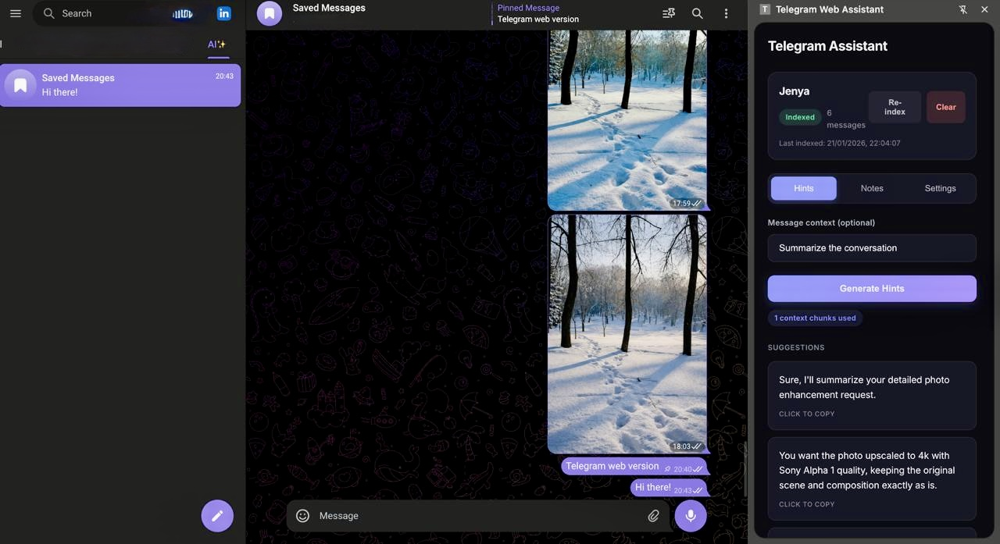

# Telegram Web Assistant

> **Warning:** This project is not production ready and will never be. Use AI wisely and with great care.

A Chrome extension that enhances Telegram Web with AI-powered reply suggestions and private notes.

## Features

- **Smart Reply Hints** - Get contextual reply suggestions based on conversation history
- **Private Notes** - Keep personal notes for each dialogue
- **Conversation Indexing** - Index chat history for intelligent context retrieval
- **Dark/Light Theme** - Seamless theme support

## How It Works

The extension uses [RAG (Retrieval-Augmented Generation)](https://github.com/hypnagonia/rag) with BM25 search to find relevant context from your conversation history. When generating reply hints, it:

1. Extracts messages from the current Telegram Web dialogue
2. Indexes them using BM25 via WebAssembly
3. Retrieves relevant context based on the current conversation
4. Generates contextual reply suggestions using an LLM (DeepSeek, OpenAI, or Claude)

## Installation

1. Clone the repository
2. Run `npm install` and `npm run build`
3. Open `chrome://extensions/` and enable Developer mode
4. Click "Load unpacked" and select the `dist` folder
5. Open [Telegram Web](https://web.telegram.org/k/) and click the extension icon

## Configuration

Open the extension side panel and go to Settings to configure:
- API Provider (DeepSeek, OpenAI, or Claude)
- API Key
- Theme preference
